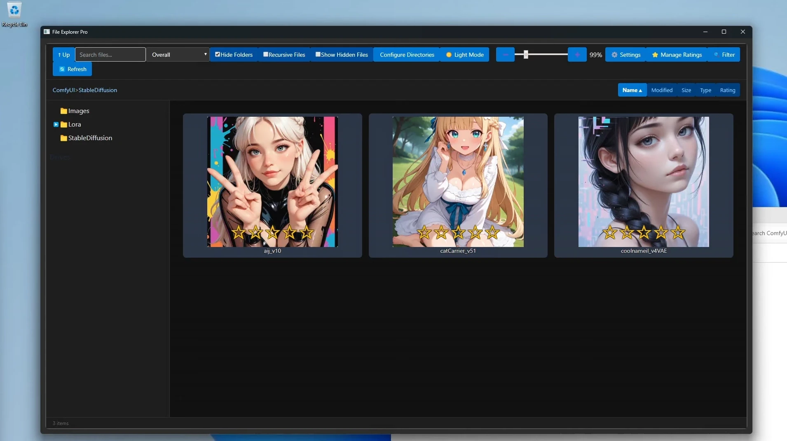

# FileExplorerPro
Program meant to make it easier to organize/sort and view your collected Stable Diffusion checkpoints and lora 

I made this entirely for personal use, but after the program started growing and growing I decided it should be refined and published as a useful tool. It's heavily biased towards my personal workflow and very very very far from optimized. I welcome anyone who actually knows what they are doing to contribute to helping optimize and improve the program, because I genuinely think it's a useful tool and I hope that others may find it useful too.

### Useful Hotkeys:
- When in the focus window (you clicked on a file and it enlarges and gives you the file details) you press left and right arrow keys to move to the previous or next file
- When you have a Gallery Image open with the focus window up (the auto-found images that are linked to the checkpoint/lora) you can press Left or Right to go through the different gallery images and Shift+Left or Shift+Right to move to the previous or next file

### Issues & Feedback wanted:
Biggest issue I'm aware of: This program absolutely EATS RAM. I think because I'm not chunking files and only loading partial/visibile files, but instead just loading everything? I used to do chunking in earlier iterations but it was so much clunkier and I don't think I implemented it well...

I strongly suggest not using the program to organize images - I find it uses an acceptable amount of RAM (under 1gig) when looking at a few hundred checkpoints or lora at a time, but loading up thousands of images will consume a ton of ram

I use this program alongside StabilityMatrix - as it downloads a <checkpointName>.preview.<imgext> and <checkpointName>.cm-info.json file that this program utilizes which is very convenient. Not necessary though

There's no cloud integration or integration with civitai or comfyui or anything fancy. Everything is all totally local

## UPDATES:
#### Recent Changes:
- Implemented lazy loading which significantly improves efficiency and responsiveness. It doesn't stream file information, so it still takes a few seconds to load a large folder (13,000 images loaded in about 3 seconds, although the first time load was much slower)

### Bugs & Features To Do:
- Metadata viewing for alternative image generation programs
- ~~"implementing a hybrid of pagination, lazy loading, caching & .db indexing" to reduce RAM usage~~
- UI Fixes
- Multi-selection and Bulk editing
- Persistence issue with 'Configure Directories' when new directories are added
  - Allow the user to configure directories *before* creating the db, limiting the files hashed
  - Allow the user to configure file types to be exclusively included
